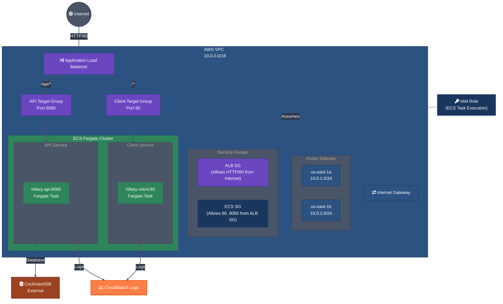

# AWS Infrastructure Diagram

## Infrastructure Components

1. **Networking**
   - VPC with public subnets in 2 AZs (us-east-1a, us-east-1b)
   - Internet Gateway for public internet access
   - Route tables for public subnets

2. **Load Balancing**
   - Application Load Balancer (ALB) with:
     - HTTP (port 80) listener
     - Target groups for API (port 8080) and App (port 80) services
     - Path-based routing (/api/* to API service)

3. **Container Orchestration**
   - ECS Cluster
   - ECS Services:
     - API Service (port 8080)
     - App Service (port 80)
   - IAM roles for ECS task execution

4. **Security**
   - ALB Security Group (allows HTTP/80 from anywhere)
   - ECS Security Group (allows traffic from ALB on ports 8080/80)

5. **Database**
   - External CockroachDB instance (configured via variables)

## Access Patterns
- External users access the application via the ALB
- ALB routes /api/* requests to the API service
- All other requests are routed to the App service
- API service connects to the external CockroachDB database
